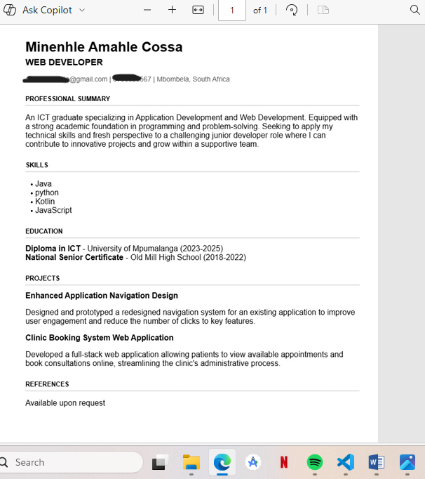

# Professional ATS Resume Builder

A modern yet simple, ATS-compliant resume builder built using HTML, CSS, and JavaScript.  
This project allows users to generate a clean, professional one-page resume and export it as a properly formatted PDF.

---

## 🚀 Features

- Live resume preview
- Add multiple education entries
- Add multiple work experience entries
- Optional projects section
- ATS-compliant formatting
- Professional PDF export (Letter size)
- Clean corporate layout
- Single-column structure for ATS compatibility

---

## 🛠 Technologies Used

- HTML5
- CSS3
- Vanilla JavaScript
- html2pdf.js (PDF generation)

---

## 📄 ATS Compliance

This resume builder follows ATS best practices:

- No tables
- No icons
- No images
- Single column layout
- Standard fonts (Arial / Helvetica)
- Clean heading structure
- Proper margins (8.5 x 11 Letter format)

---

## 📷 Screenshot



---

## 🌍 Live Demo

https://enhle-debug.github.io/digital-resume-builder/

---

## 📦 Installation

Clone the repository:

```bash
git clone https://github.com/Enhle-debug/ats-resume-builder.git
```

Open `index.html` in your browser.

---

## 👩🏽‍💻 Author

Minenhle Cossa  
ICT Graduate | Front-end Developer
